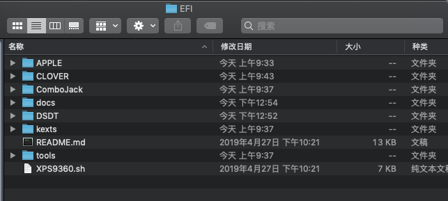
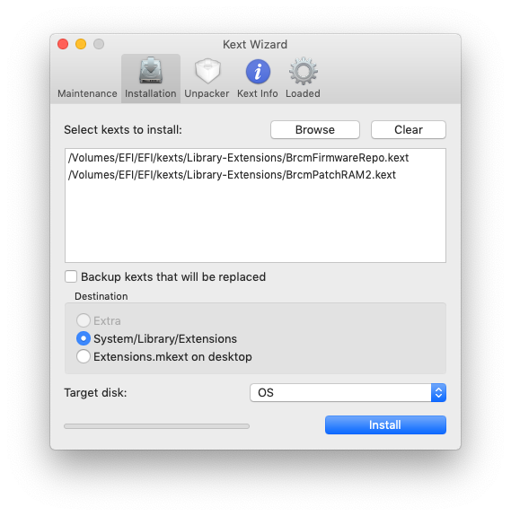
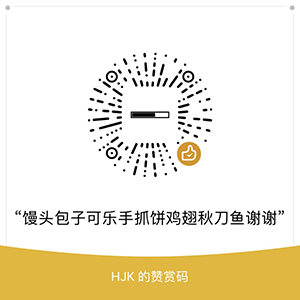

# XPS13-9360-i5-8250U-macOS

Hackintosh macOS Mojave 10.14 on XPS13-9360  黑苹果10.14安装配置及教程

网络上中文资料很少，尤其是8代CPU的XPS。而我又是一个原版镜像控，又追求最新版的系统和软件，资料更是少之又少。搞这个东西前前后后搞了一个多月，系统崩溃重装无数次，现在终于稳定，各项功能基本和白苹果一致，故记录成文给后来者一个参考。


## 硬件配置参考

- 型号：XPS13-9360
- CPU：Intel i5-8250U
- GPU：Intel UHD Graphics 620
- 内存：8GB
- 显示器：1920x1080
- SSD：KXG50ZNV256G NVMe TOSHIBA 256GB
- 无线网卡：Dell DW1560 BCM94352Z （购于淘宝自行更换）

配件及外接设备：

- USB Type-C转接器：Dell DA300（含有线网卡）
- 外接过的显示器：
  - Lenovo ThinkVision LEN LT2223wA 21.5寸 1920x1080
  - Dell U2718Q 27寸 4k
- USB有线网卡：KY-QF9700 （驱动好找，临时使用）
- USB无线网卡：TL-WN823N（驱动好找，临时使用）

系统及BIOS：

- 系统：macOS 10.14 Mojave（单系统，没有Windows）
- BIOS：2.9.1


## 使用情况说明

正常使用：

- 能够正常引导开机关机
- USB口都可用
- 外接显示器可用
- 触控板可用并支持多种手势
- 扬声器/耳机/麦克风可用
- 屏幕亮度可调节
- 键盘灯可控
- 蓝牙可用
- WiFi可用
- Airdrop可用
- 睡眠可唤醒
- 耗电情况正常，感觉续航还行
- 发热情况正常

存在的问题：

- 外接显示器热插拔可能会导致启动故障（一般重启可解决）
- 睡眠唤醒后偶尔会蓝牙不可用（一般重启可解决）
- SD卡口屏蔽了，没去折腾过
- 触控板虽然支持多种手势，但是面积较小，不如macbook方便


## 制作U盘镜像

从这里开始是教程真正开始的部分，首先要做好系统安装失败崩溃无数次的心理准备。然后准备一个大于8G（推荐16G以上）的U盘，和运行macOS系统的电脑就可以开始了。用苹果电脑制作是为了获得原版镜像，当然也可以用Windows制作，可以查找一下相关教程。

1. 从App Store下载镜像，大约半小时。
2. 在磁盘工具左上角选择显示所有设备，格式化U盘，GUID分区，格式为Mac OS Extended      (Journaled)，名字为USB。
3. 把镜像写入到U盘：

```bash
sudo /Applications/Install\ macOS\ Mojave.app/Contents/Resources/createinstallmedia --volume /Volumes/USB --applicationpath /Applications/Install\ macOS\ Mojave.app --nointeraction
```


4. 用tools目录下的Clover Configuration挂载EFI分区（注意区分是不是U盘，不要挂错了），然后把所有东西复制到EFI分区的EFI目录内。


## 配置BIOS

开机按F2进入BIOS，按照下面一项一项配置，如果你对每一项配置了如指掌也可以自行配置。

\- Sata: AHCI

\- Enable SMART Reporting

\- Disable thunderbolt boot and pre-boot support

\- USB security level: disabled

\- Enable USB powershare

\- Enable Unobtrusive mode

\- Disable SD card reader (saves 0.5W of power)

\- TPM Off

\- Deactivate Computrace

\- Enable CPU XD

\- Disable Secure Boot

\- Disable Intel SGX

\- Enable Multi Core Support

\- Enable Speedstep

\- Enable C-States

\- Enable TurboBoost

\- Enable HyperThread

\- Disable Wake on USB-C Dell Dock

\- Battery charge profile: Standard

\- Numlock Enable

\- FN-lock mode: Disable/Standard

\- Fastboot: minimal

\- BIOS POST Time: 0s

\- Enable VT

\- Disable VT-D

\- Wireless switch OFF for Wifi and BT

\- Enable Wireless Wifi and BT

\- Allow BIOS Downgrade

\- Allow BIOS Recovery from HD, disable Auto-recovery

\- Auto-OS recovery threshold: OFF

\- SupportAssist OS Recovery: OFF

这个时候U盘应该可以正常启动（按F8选择从U盘启动）了，如果开机启动项里面没有找到U盘，可以在BIOS里面手动添加一个启动项，启动项路径为/EFI/EFI/CLOVER/CLOVERX64.efi

启动成功后应该进入了CLOVER界面，选择启动Shell，启动的是位于CLOVER/tools目录下的Shell64U.efi。这个Shell是用于修改BIOS配置，另一个Shell已经重命名为Shell64U.efi.bak，如果修改完BIOS配置后有需要的话，可以将Shell64U.efi.bak改回来（一般情况下不需要这么做）。

进入Shell以后主要修改以下三项：

| Variable              | Offset | 默认值  | 修改值   | Comment                                                    |
| --------------------- | ------ | -------------- | --------------- | ---------------------------------------------------------- |
| CFG Lock              | 0x4de  | 0x01 (Enabled) | 0x00 (Disabled) | Disable CFG Lock to prevent                                |
| DVMT Pre-allocation   | 0x785  | 0x01 (32M)     | 0x06 (192M)     | Increase DVMT pre-allocated size to 192M for QHD+ displays |
| DVMT Total Gfx Memory | 0x786  | 0x01 (128M)    | 0x03 (MAX)      | Increase total gfx memory limit to maximum                 |

修改命令分别如下：

```
setup_var 0x4de 0x00
setup_var 0x785 0x06
setup_var 0x786 0x03
```

输入exit退出Shell，然后重启进行安装。

## 安装macOS

重启之后到CLOVER界面选择Install macOS Mojave，如果能正常启动的话，那就恭喜了。如果不能正常启动，建议回到CLOVER界面，选择Options，在启动参数里面（按回车开始输入，按回车结束输入）加上-v看看详细报错然后去网上查查资料。

进入安装界面后，先选择磁盘工具对磁盘进行格式化，注意左上角选择显示所有设备，格式选择APFS，不要区分大小写，不然安装不了Adobe系列产品。然后选择磁盘后就可以开始安装了。

安装过程中会重启多次，如果没找到正确的启动项，可以手动选择一下。

如果顺利的话，安装完成最后一次启动是macOS，进入系统了。

## 后续设置

到目前为止，启动还是通过U盘里的CLOVER引导的，所以第一件事情是把CLOVER安装到硬盘上。同样用Clover Configuration挂载硬盘的EFI分区，和U盘一样，把文件复制进去，大概如下所示。



然后运行终端，cd到该目录下，运行如下几条命令：

```bash
bash XPS9360.sh --compile-dsdt
bash XPS9360.sh --patch-hda
bash XPS9360.sh --enable-3rdparty
bash XPS9360.sh --disable-touchid
```

然后用Clover Configuration随机生成以下几个序列号：


接着打开EFI/tools里面的Kext Wizard程序，把EFI/kexts/Library-Extensions里面的三个kext文件安装到/System/Library/Extensions/目录：



整个安装过程到此就全部结束了，可以重启试试是不是所有功能都运行正常。如果不正常的话，需要自己检查一下问题出在哪里。

如果觉得有帮助的话，欢迎打赏。



## Credits

- [Dell XPS 13 9360 Guide by bozma88](https://www.tonymacx86.com/threads/guide-dell-xps-13-9360-on-macos-sierra-10-12-x-lts-long-term-support-guide.213141/)
- [macOS on Dell XPS 9360](https://github.com/the-darkvoid/XPS9360-macOS)
- [OS-X-BrcmPatchRAM](https://github.com/RehabMan/OS-X-BrcmPatchRAM)
- [READ FIRST! Laptop Frequent Questions](https://www.tonymacx86.com/threads/faq-read-first-laptop-frequent-questions.164990/)
- 以及其他工具、kext、文章贡献者
